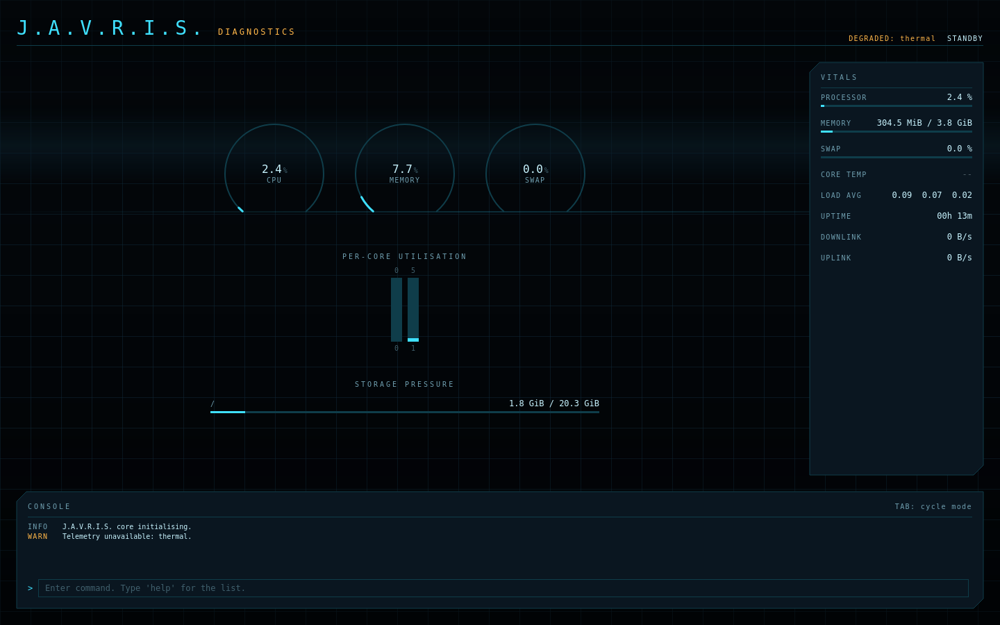
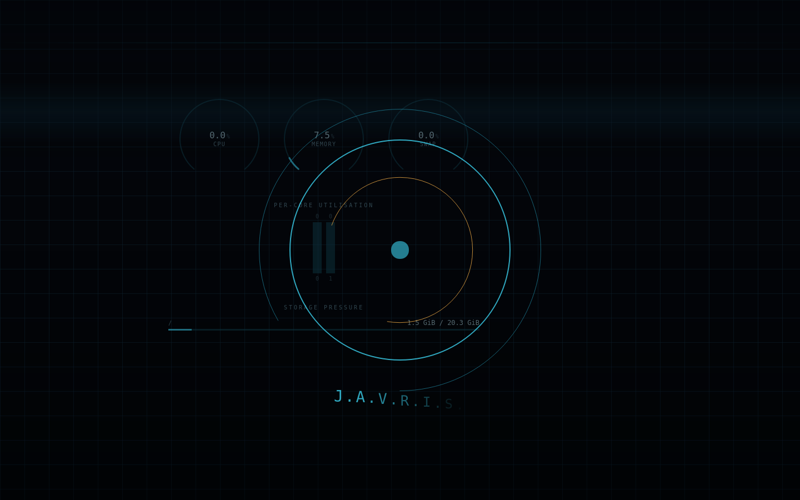
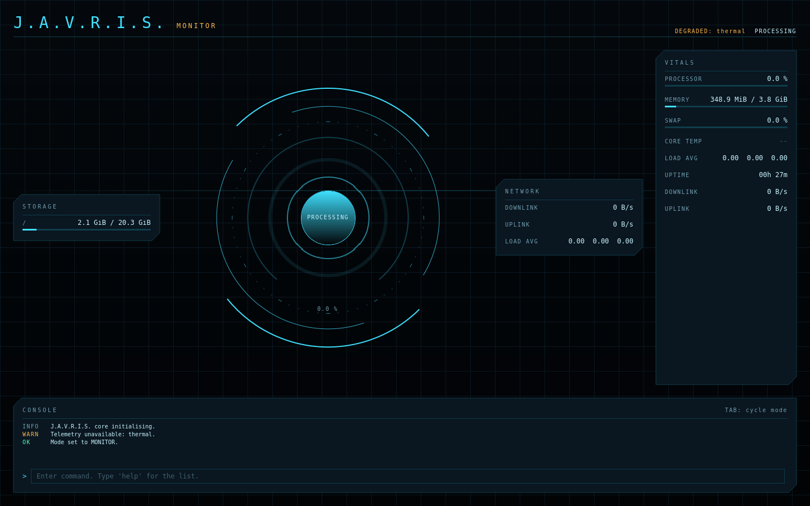
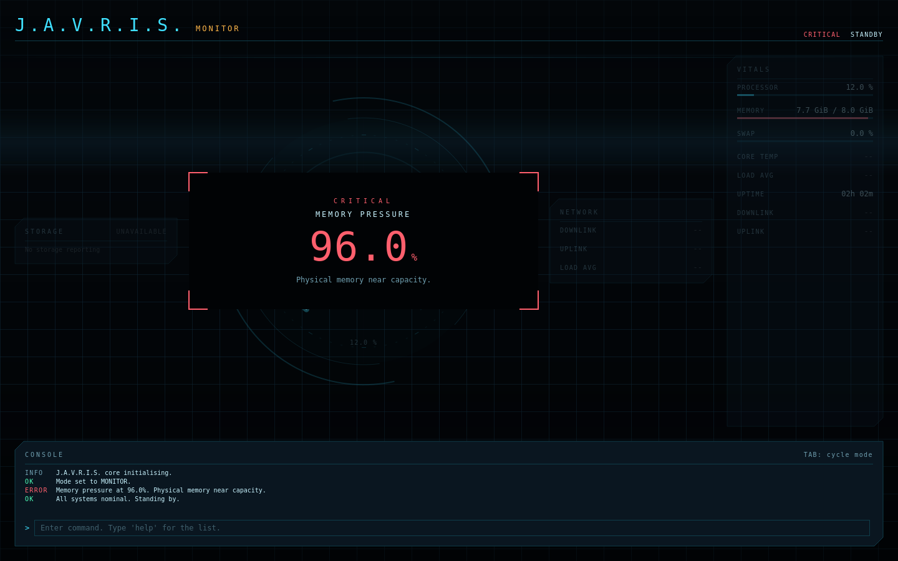

# J.A.V.R.I.S. GUI

A native Linux heads-up display in the J.A.R.V.I.S. design language, driven by **real
system telemetry**. Built with Qt 6 / QML and PySide6.

Not a mock-up and not a wallpaper: every figure on screen is read from the kernel, and
anything the kernel will not report is shown as unavailable rather than faked.



## Features

- **Two modes that recompose the whole surface.** `DIAGNOSTICS` foregrounds gauges,
  per-core bars and storage pressure; `MONITOR` foregrounds the reactor core with
  storage and network detail. Mode-driven layout is a defining property of the
  reference design language (see [`docs/RESEARCH.md`](docs/RESEARCH.md)).
- **Real telemetry** from `/proc` and `/sys`: aggregate and per-core CPU utilisation,
  memory, swap, load average, uptime, CPU package temperature, filesystem usage and
  network throughput.
- **Reactor core as an instrument, not an ornament.** Ring rotation encodes assistant
  state, arc sweep and colour encode load, and the tick ring provides the scale.
- **An explicit assistant state machine** — `BOOTING · STANDBY · LISTENING ·
  PROCESSING · EXECUTING · SPEAKING · ERROR · OFFLINE` — with illegal transitions
  rejected rather than silently applied.
- **Honest failure behaviour.** A missing sensor, an unreadable `/proc` node or a
  container with no thermal zone degrades to a labelled `--` and a console warning.
  The HUD never displays an invented number.
- **Attention escalation — the HUD interrupts you.** A peripheral gauge cannot capture
  attention, so when a metric goes critical while it is *not* already centre-stage, the
  condition is promoted into the middle of the display and everything else dims. It
  requires a sustained breach, applies hysteresis so it cannot flap, and escalates one
  thing at a time. This is the behaviour that makes it an assistant rather than a
  dashboard; the reasoning and citations are in [`docs/RESEARCH.md`](docs/RESEARCH.md)
  §7. There is **no eye tracking** — the documented substitute is whether the metric is
  already central in the active mode.
- **Console with allow-listed commands.** No shell execution, no network, no secrets.

- **A motion language, not just animation.** The HUD boots by assembling itself —
  energy streaks converge, rings trace themselves in, the name resolves letter by
  letter. Layers drift against the pointer at three different depths, the core
  breathes, and a radar sweep runs only while the assistant is actually working.
  Every assistant state change fires an "alpha event": a single ring travelling
  outward, so transitions are felt rather than merely relabelled. All of it is
  bounded by research the reference HUD itself failed
  ([`docs/RESEARCH.md`](docs/RESEARCH.md) §13-16): nothing expands in place, nothing
  relocates a reading, and `--no-ambient` switches every decorative animation off.



*Power-on: rings tracing themselves in as the name assembles.*



*`MONITOR` mode with the reactor core in `PROCESSING` — the amber sweep runs only
while the assistant is actually working.*



*A sustained memory-pressure condition escalated into the main display. The header
agrees with the banner, and the rest of the HUD recedes rather than competing.*

## Requirements

- Linux (X11 or Wayland)
- Python 3.10 or newer
- Qt 6 runtime libraries, which the PySide6 wheels bundle. On a minimal system you
  may still need `libgl1`, `libegl1`, `libxkbcommon0`, `libdbus-1-3` and
  `libfontconfig1` from your distribution.

## Install and run

```bash
git clone https://github.com/thecyberexpert123-stack/J.A.V.R.I.S.-GUI.git
cd J.A.V.R.I.S.-GUI

python3 -m venv .venv
source .venv/bin/activate
pip install -e .

javris                 # full screen
javris --windowed      # normal window, useful for tiling WMs
javris --interval 500  # faster telemetry polling, in milliseconds
javris --no-ambient    # disable decorative motion (telemetry unaffected)
```

Or without installing: `python -m javris --windowed`.

## Usage

| Action | How |
|---|---|
| Switch mode | `Tab`, or `mode diagnostics` / `mode monitor` |
| Focus the console | `Esc` |
| List commands | `help` |
| Quit | `shutdown` |

## Architecture

QML owns presentation; Python owns data and policy. Nothing in QML reads `/proc`, and
nothing in Python emits a colour.

```
QML presentation                      Python backend
  HudSurface.qml  ......  reads  ....  HudController   assistant state, formatting,
  Theme.qml (design tokens)            │               command entry
  components/  Panel · Gauge           ├── TelemetrySampler  polling, rate deltas
               ReactorCore             ├── ProcReader        the ONLY /proc reader
               TelemetryRow · LogStream└── CommandRouter      allow-list dispatch
  modes/  DiagnosticsMode · MonitorMode
```

Data flows one way, backend to QML. QML mutates state only through explicit slots.
`ProcReader` takes its filesystem root by injection, so the whole telemetry layer is
tested against fixture directories with zero access to the real `/proc`.

Full detail: [`docs/PLAN.md`](docs/PLAN.md). Toolkit evaluation and design research
with citations: [`docs/RESEARCH.md`](docs/RESEARCH.md).

## Development

```bash
pip install -e ".[dev]"
./tools/check.sh
```

The gate runs ruff (lint + format), mypy `--strict`, pytest, qmllint, the Qt Quick
Test suites, and a headless render. All of it must pass.

In a minimal container lacking `libGL`/`libEGL`/`libdbus`/`libxkbcommon`, run
`JAVRIS_GL_STUBS=1 ./tools/check.sh` — see
[`tools/sandbox_gl_stubs.py`](tools/sandbox_gl_stubs.py) for what that does and the
strict limits on it.

If you change a property, signal or slot on `HudController`, regenerate the QML type
description so the linter stays in step:

```bash
python tools/generate_qmltypes.py
```

## Security posture

- No network access and no API keys.
- No shell execution: the console maps a fixed vocabulary onto in-process handlers,
  and input is length-capped with control characters stripped.
- `/proc` and `/sys` are read-only, through a single module, with a fixed path set.
- Runtime dependencies: PySide6 only.

## Licensing

This project is licensed under the MIT License — see [`LICENSE`](LICENSE).

It depends on PySide6/Qt, used unmodified under the LGPLv3. See
[`THIRD-PARTY-NOTICES.md`](THIRD-PARTY-NOTICES.md).

## Credits

Design language researched from the published accounts of the people who created the
original HUD, and prior open-source work is credited in
[`docs/CREDITS.md`](docs/CREDITS.md). This project is an independent work inspired by
the fictional interface; it is not affiliated with or endorsed by Marvel or Disney.
