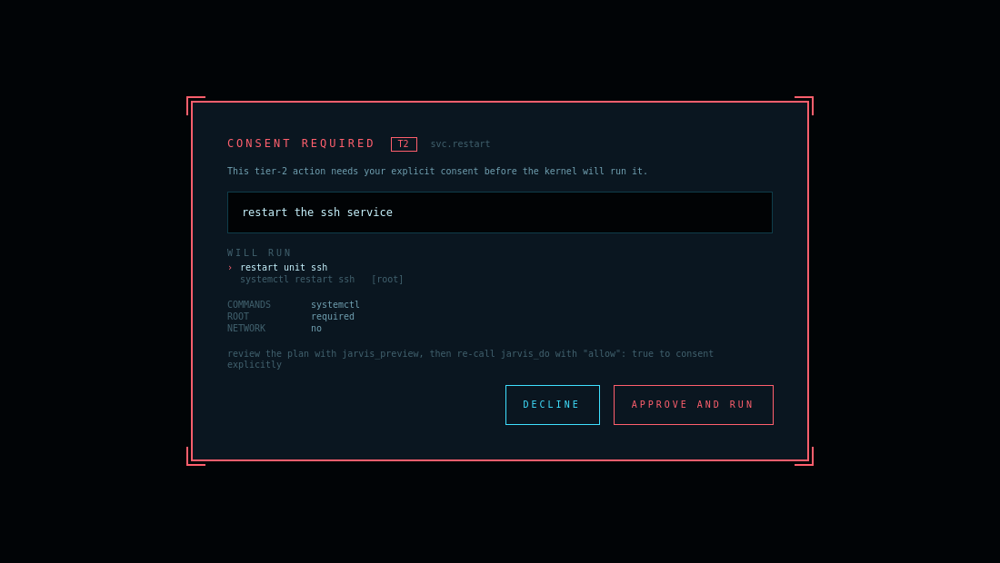
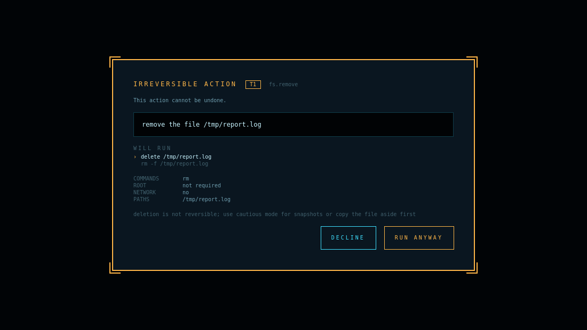

# Backend bridge — the J.A.V.R.I.S. kernel

This GUI is the front-end for the sibling repository
[`J.A.V.R.I.S.`](https://github.com/thecyberexpert123-stack/J.A.V.R.I.S.)
(branch `arena/01a06229-j-a-v-r-i-s`, package `jarvis-agent`). The backend
publishes a front-end contract, `javris-frontend/1`, and this document records
how we consume it — including several places where the live kernel does not
behave the way a first reading of the documentation suggests.

Everything below marked **verified** was observed against a running kernel in
this workspace, at version **1.18.0**. Nothing here is inferred from the
backend's documentation alone. Where the backend's own wiring doc
(`docs/integration/JAVRIS-GUI.md`, last revised for 1.12.0) and the running
kernel disagree, the running kernel wins and the difference is noted.

## Transport

Two transports are supported. Both carry identical consent semantics, and the
same audited classifier decides every outcome for both.

| | On demand (default) | Resident (opt-in) |
| --- | --- | --- |
| Mechanism | spawn `jarvis mcp serve` | `POST http://127.0.0.1:8777/v1/tools/<tool>` |
| Wire | newline-delimited JSON-RPC 2.0 on stdio | JSON over HTTP, bearer token |
| Enabled by | nothing; always available | owner runs `jarvis serve install` |
| Process owned by | this GUI | the owner's session |
| Payload | `result.content[0].text` — a JSON **string** | `result` — an already-decoded **object** |

Resident mode is preferred automatically **when the owner has installed it**;
otherwise the kernel is spawned on demand. Either way it takes an explicit
`connectAgent()` — the GUI never connects on launch, because starting something
that can change the machine is the owner's decision.

### On-demand specifics

Protocol version `2025-03-26`; the server echoes the client's date version
verbatim. `serverInfo` reports `{"name": "jarvis", "version": "1.18.0"}`.

stderr carries a human banner and **must never be parsed as protocol** — the
`QProcess` runs in `SeparateChannels` mode precisely so a diagnostic line can
never be mistaken for a frame. Program and argument list are passed separately,
so no shell is involved.

`KernelClient.executable()` searches exactly two places: `PATH`, then the bin
directory of the running interpreter (a virtualenv holding both the GUI and the
kernel is usually not on the desktop session's `PATH`, yet it is unambiguously
the same install). No other directory is searched — guessing at locations would
let the GUI execute a binary the operator never pointed it at.

### Resident specifics

The doorway's security posture was verified independently rather than taken
from ADR-0018:

| Probe | Result |
| --- | --- |
| `GET /v1/health` | `200 {"ok": true}`, no auth required |
| `POST /v1/tools/jarvis_status` without token | **`401`** |
| `POST` with token | `200`, `{"result": {...}, "isError": false}` |
| `POST` with `Host: evil.com` | **`421`** |
| Token file mode | **`0600`** |
| Token in server logs | **absent** |

This client refuses any non-loopback endpoint before a request is built, and
refuses a token file readable by group or other. The token is sent only as an
`Authorization` header — never in a URL, never logged. The kernel version is
read from the `Server` header (`jarvis-serve/1.18.0 Python/3.11.2`).

When the doorway is missing or its token unreadable, that is an honest
"not configured" and the GUI falls back to spawning. It is never an error.

## The consent model

This is the part most worth getting right, and the part where the documentation
alone would have misled us.

> **Verified:** the consent gate is per-**tier**, not per-tool.

`jarvis_do` is published as `explicit-allow`, which reads as though every `do`
requires approval. It does not:

| Tier | Behaviour without `allow` | Kernel offers consent? |
| --- | --- | --- |
| 1 | **Executes immediately.** `jarvis_do "install htop"` ran `apt-get install -y -- htop` with no confirmation. | No — nothing to confirm |
| 2 | Refused: `outcome.status = "refused"`, `outcome.tier = 2`, plus a hint | **Yes** |
| 3 | Refused unconditionally; consent cannot lift it | No |

### Refusal is not failure

> **Verified:** a refusal arrives with `isError: true`, exactly like a genuine
> failure. They are distinguished **only** by `payload.outcome.status ==
> "refused"`.

Treating `isError` alone as an error would report the safety kernel working
correctly as a malfunction. `classify_outcome` separates `REFUSED` from
`FAILED`, and the HUD styles a refusal as a decision point with the kernel's own
hint attached, not as a fault.

### The hybrid gate

Tiers answer *"how much authority does this need?"*. They do not answer
*"can this be taken back?"*, and those come apart:

```
do remove the file /tmp/x   ->  tier 1, ran immediately, no prompt
                                undo.status = "unavailable"
```

The kernel is right: `rm` of a user-owned file is a user-level action, and
demanding system-level consent for it would be wrong. It is nonetheless an
irreversible deletion that happened with no confirmation, because the GUI asked
for none. So there are **two gates, different in kind**:





| | Gate 1 — kernel consent | Gate 2 — reversibility |
| --- | --- | --- |
| Owned by | the kernel | this GUI |
| Fires when | kernel refuses a T2 action | kernel reports `undo` unavailable |
| Saying yes | **grants authority** (`allow: true`) | **acknowledges risk** (no `allow`) |
| Can be disabled | never | yes, `confirm kernel-only` |
| Colour | error red, "APPROVE AND RUN" | warning amber, "RUN ANYWAY" |

The distinction is preserved everywhere, including visually. Collapsing them
into one treatment would train the owner to read both as the same kind of
warning, devaluing the one that carries real authority.

Gate 2 is driven **entirely by the kernel's own `undo.status`** — there is no
hardcoded list of dangerous-looking words. Pattern-matching request text would
be security theatre and would disagree with the kernel about what a request
actually does. `none_needed` (idempotent) counts as reversible; anything
unrecognised counts as irreversible, because guessing optimistically about
reversibility is the one error that cannot be corrected afterwards.

Policy is owner-configurable at the console:

| Command | Gate 2 behaviour |
| --- | --- |
| `confirm irreversible` | ask when undo is unavailable *(default)* |
| `confirm always` | ask before every mutation |
| `confirm kernel-only` | never; defer entirely to the kernel's tiers |

Gate 1 applies under **all three**.

### Where `allow` comes from

`allow: true` is generated in exactly one place: `Controller.approveConsent()`
when the pending gate is `KERNEL_CONSENT`. It is never defaulted, never
remembered, and never inferred from a previous approval. Both framers
(`protocol.build_tool_call` and `resident.build_body`) raise if `allow` is
passed to a read-only tool.

Clearing gate 2 sends the request **without** `allow`. If the kernel then wants
consent, it asks through gate 1 — the GUI's own gate cannot pre-satisfy the
kernel's.

The request re-sent after approval is the **verbatim** text the owner was shown,
never a reconstruction. The prompt has no default action, no timeout, and no
keyboard activation: Escape declines, and approving requires a deliberate
pointer click.

## Plan review

`jarvis_preview` returns far more than step descriptions, and the GUI now
renders all of it rather than flattening it to one line:

| Field | Shown as |
| --- | --- |
| `preview.steps[].description` | the step list |
| `preview.steps[].argv` | the exact command, verbatim and unquoted |
| `preview.steps[].requires_root` | a `[root]` marker |
| `preview.tier` | the `T<n>` badge |
| `preview.playbook` | the matched playbook id |
| `preview.undo` | drives gate 2 and its explanation |
| `blast_radius.commands` / `.paths` / `.network` / `.requires_root` | the blast-radius block |

The argv is deliberately **not** shell-quoted: the kernel never uses a shell,
and quoting would imply the string could be pasted into one and mean the same
thing.

### The unmatched request

> **Verified:** an unmappable request returns `isError: true` with empty steps,
> `playbook: "<unmatched>"`, and an anti-hallucination message.

That is the kernel *refusing to guess*, which is a feature, not a crash. The
GUI shows the refusal plus the count and first several of the 57 known
playbooks parsed out of the hint. `<unmatched>` is a sentinel and is never
displayed as though it were a playbook name.

## Payload shapes

Success shapes differ per tool:

- `jarvis_explain` → `{ai_text, claim, fact_id, machine, note, question, sources, status}`
- `jarvis_preview` → `{blast_radius, preview}`
- `jarvis_do` → `{outcome}` with `steps[].argv`, `exit_code`, `requires_root`
- `jarvis_status` → flat machine description (`distro_name`, `package_manager`, …)
- `jarvis_suggest` → `{suggestions[], canary, note}`, each suggestion carrying `evidence[]`

Kernel text is capped at 4000 characters before reaching the log renderer. The
kernel is trusted, but not trusted to be bounded.

## Voice input

The kernel ships a voice stack (ADR-0019) whose `jarvis voice ask` records,
transcribes, **runs the request**, and speaks the outcome. **The GUI
deliberately does not use that command.**

`voice ask` executes autonomously. Shelling out to it would let a misheard
sentence reach the kernel without passing either GUI gate, and the owner would
never have seen the words that were acted upon. So the GUI uses only the first
half of the pipeline:

```
record  ->  transcribe  ->  put the text in the console input
```

The transcript is placed in the input field for the owner to read and submit;
it is never auto-submitted. Speech is treated as a keyboard that can mishear.
Every downstream gate then applies unchanged, and ADR-0019 D3 — "speech
misrecognition must never manufacture per-call consent" — holds a fortiori:
voice here cannot even *initiate* an action, let alone consent to one.

Capture is bounded (1–15 s), transcripts are capped at 500 characters, and the
recorded WAV is deleted as soon as it has been transcribed — a HUD is not a
recording device. The microphone button is hidden entirely when the machine
cannot transcribe; `voiceStatus` explains what is missing.

## Console verbs

| Verb | Tool | Notes |
| --- | --- | --- |
| `ask <question>` | `jarvis_explain` | Read-only |
| `plan <request>` | `jarvis_preview` | Read-only; shows the plan without running it |
| `do <request>` | `jarvis_preview` → `jarvis_do` | Previews first so gate 2 can see `undo` |
| `suggest` | `jarvis_suggest` | Evidence-backed; the kernel executes nothing |
| `confirm <policy>` | — | Local: gate-2 policy |
| `agent status` | `jarvis_status` | Machine description |
| `agent disconnect` | — | Local: ends the session |

## Layering

`bridge/protocol.py`, `bridge/plan.py`, `bridge/consent.py`, `bridge/resident.py`
and `bridge/voice.py` are pure: no Qt, no I/O. Framing, plan parsing, consent
classification and gate policy are all testable without spawning anything,
which is why the security invariants can be asserted directly against captured
live frames.

`bridge/client.py` (stdio), `bridge/resident_client.py` (HTTP) and
`bridge/voice_client.py` (capture) own the Qt objects. The two transports expose
an identical signal surface, so nothing downstream branches on which is in use.

The HTTP envelope is normalised into the stdio shape
(`resident.envelope_to_message`) so that `protocol.classify_outcome` remains the
**single** implementation of the refusal-versus-failure distinction. Two
parallel classifiers would be two places for that distinction to drift, and it
is the one that must not drift.

## Verified end-to-end

Against the live kernel at 1.18.0, through the real `Controller`:

- **stdio:** handshake → `1.18.0`; `explain` → `OK`
- **resident:** health → `1.18.0` from the `Server` header; refusal classified
  identically to stdio (consent parity)
- **transport selection:** resident preferred when installed; falls back to
  spawning when the token is absent
- **gate 2** fires on tier-1 `rm` (irreversible), showing argv and paths
- **gate 1** fires on tier-2 `restart` (reversible), showing the T2 badge
- **unmatched** request produces no dialog — the kernel's refusal-to-guess and
  57 playbook names instead
- decline → nothing runs; approve → re-sent verbatim with `allow: true`
- **voice** (with a stubbed recorder and STT): timestamps and `[BLANK_AUDIO]`
  annotations stripped, transcript delivered to the input field, never executed

Not verified: the spoken loop against real `arecord`/`whisper` binaries, which
are not installed in this environment. The argv construction matches the
kernel's own and is unit-tested, but no real microphone has been exercised.
